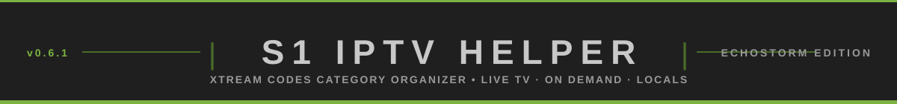
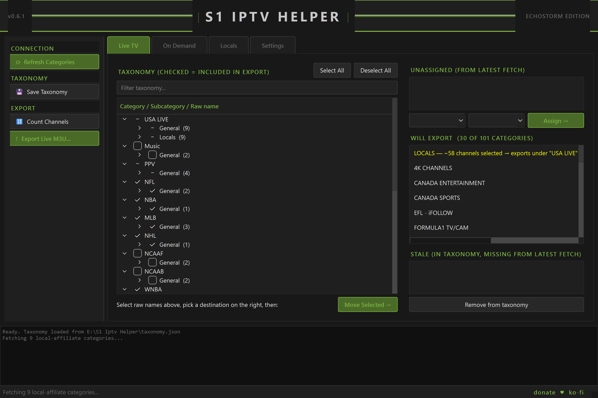
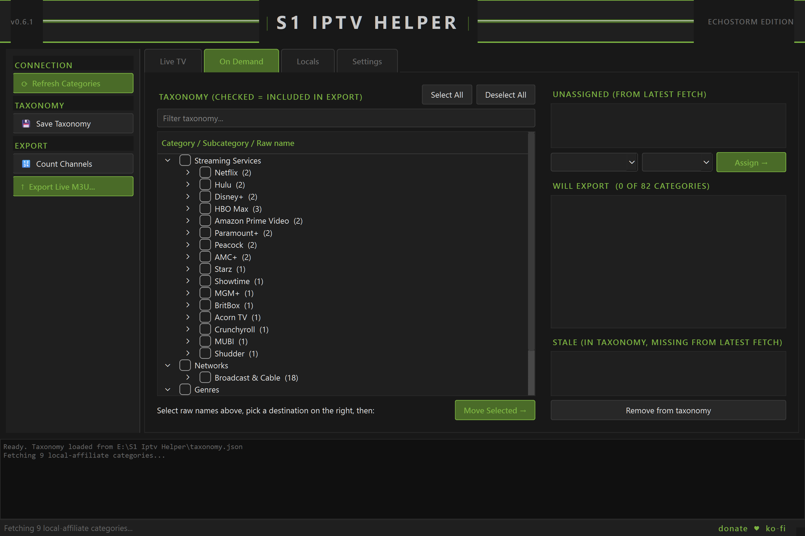
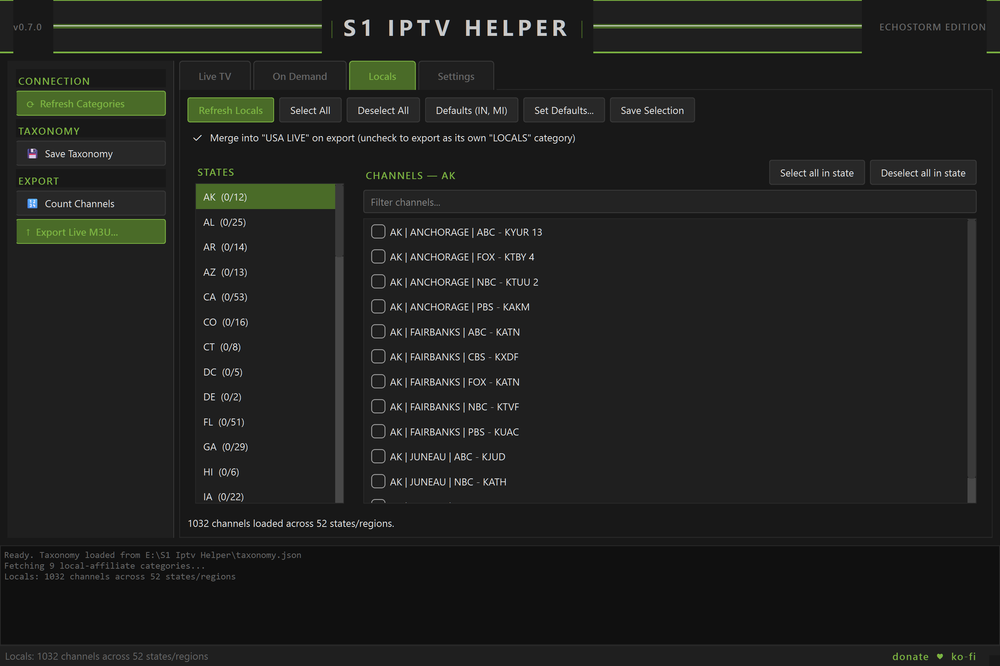
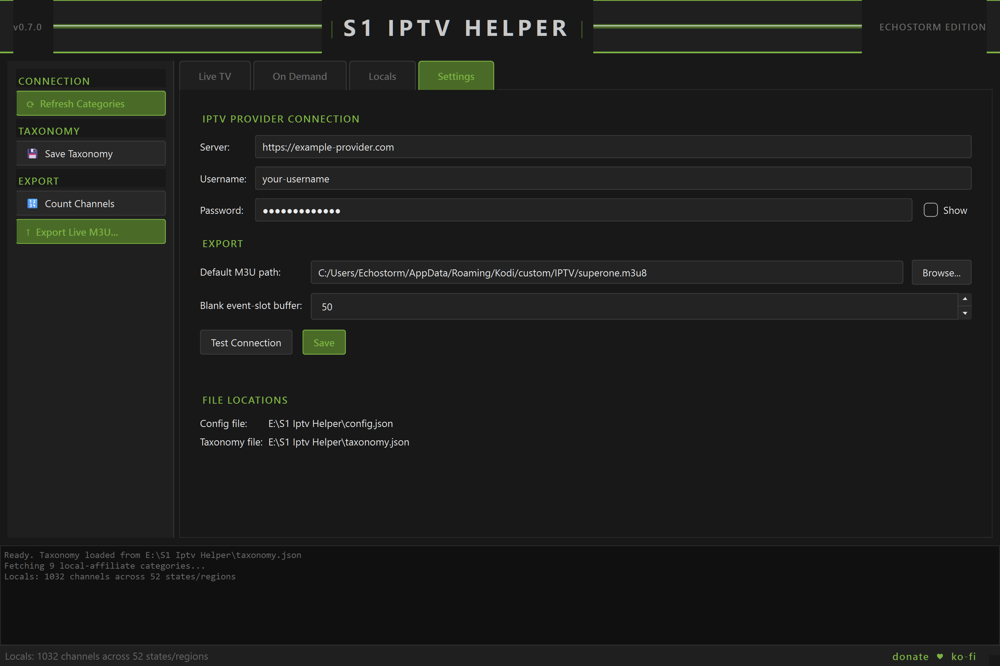

<p align="center">
  
</p>

A PyQt6 desktop tool for organizing an **Xtream Codes-compatible IPTV
service's** live-TV and on-demand (movies/series) categories into a curated
**category → subcategory** structure. Works with any Xtream Codes API
(`player_api.php`) provider — it doesn't target, endorse, or bundle access
to any specific service. Bring your own subscription's server/username/
password; this tool only organizes what that account's API already exposes.

This is *not* a per-channel picker for Live TV/On Demand. The goal is to
group the provider's raw, frequently-renamed category list (e.g. `USA NFL
GAMES`, `UFC EVENTS`, `Netflix`, `Hulu`) under stable umbrella categories
with subcategories (e.g. Live → **Sports** → PPV / NFL / NBA / ...; On
Demand → **Streaming Services** → Netflix / Hulu / ...), so the curation
survives the provider renaming things underneath it. The **Locals** tab is
the one place that *is* a per-channel picker, for state-affiliate channels
specifically.

## Features

- **Curated taxonomy that survives provider reshuffles** — raw categories
  map to stable category → subcategory groups, with an Unassigned/Stale
  panel that flags anything the provider renamed or removed on the next
  fetch instead of silently breaking.
- **Live M3U export** with automatic blank-event-slot trimming — many
  providers reserve hundreds of numbered placeholder slots per sport/PPV
  category that only get a real title once an event airs; this trims each
  category down to its real content plus a configurable buffer, instead of
  exporting hundreds of dead rows.
- **Locals tab** — a dedicated per-channel picker for state/local-affiliate
  channels (grouped automatically by state), separate from the
  category-level taxonomy. Auto-loads on startup.
- **In-app settings** — provider credentials, export path, and export
  behavior are all editable from the app; no manual JSON editing required
  day to day.
- **Automated test suite** — 70 tests covering the taxonomy store, export
  logic, and UI behavior.

## Screenshots

| Live TV | On Demand |
|---|---|
|  |  |

| Locals | Settings |
|---|---|
|  |  |

## Setup

1. Install Python 3.10+.
2. Copy `config.example.json` to `config.json` and fill in your IPTV
   username/password (or just run `launch.bat` once — it does this for you
   and pauses so you can edit it).
3. Run `launch.bat`.

`config.json` is gitignored — it holds your account's plaintext credentials
and is never committed.

## Testing

```bash
venv\Scripts\python -m unittest discover -s tests -v
```

Offscreen PyQt6 `unittest` tests, no extra dependency — see
[`tests/README.md`](tests/README.md) for what's covered.

## Project layout

```
s1iptv/             application package
  main.py           entry point
  theme.py          shared QSS (dark/green theme)
  xtream_client.py  Xtream Codes API client (live + VOD categories/streams)
  category_store.py category -> subcategory taxonomy model, JSON-backed
  main_window.py    main window / UI
docs/                design & maintenance documentation
config.example.json  credential template (tracked)
config.json           real credentials (gitignored)
```
